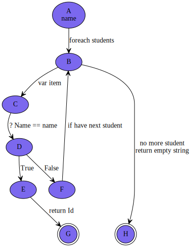

<!--<link href="https://fonts.googleapis.com/css2?family=Source+Code+Pro&display=swap" rel="stylesheet">-->
<link href="https://fonts.googleapis.com/css2?family=Fira+Code&display=swap" rel="stylesheet">
<link href="../static/main.css" rel="stylesheet" />

## Homework2 (第二組)

::::columns

:::column

程式資料
``` {.cs .numberLines}
public class Student
{
    public readonly string Id;
    public readonly string Name;
    public Student(string id, string name)
    {
        Id = id;
        Name = name;
    }
}
/// ..... 略
_students = new List<Student>
{
    new Student("4094W007", "Nick"),
    new Student("4094W010", "Aven"),
    new Student("4094W011", "Totti"),
    new Student("4094W012", "Jeff"),
    new Student("4094W008", "Terry"),
};
```
程式邏輯
```{.cs .numberLines startFrom="1"}
/// 找到，返回查找的學生學號
/// 沒找到，返回空字串
public string Find(string name, 
    List<Student> students)
{
    foreach (var item in students)
    {
        if (item.Name == name)
        {
            return item.Id;
        }
    }
    return "";
}
```
:::

:::column
## Graph

<!-- { width: 200px; }-->

:::

::::

## Edge Coverage 

* [A B]
* [B C]
* [C D]
* [D E]
* [D F]
* [F B]
* [E G]
* [B H]

<p class="pagebreak" />

students = { 
    new Student("4094W007", "Nick"), 
    new Student("4094W010", "Aven"), 
    new Student("4094W011", "Totti"),
};

### test case 1

1. input values: "Totti"
2. expected result: "4094W011"
3. test program's result: "4094W011"

edge coverage:  [A B] [B C] [C D] [D F] [F B] [D E] [E D]

### test case2 

1. input values: "John"
2. expected result: ""
3. test program's result: ""

edge coverage:  [A B] [B C] [C D] [D F] [F B] [B H]

## Edge-Pair Coverage 

* [A B C]
* [A B H]
* [B C D]
* [C D E]
* [C D F]
* [D E G]
* [D F B]
* [F B C]
* [F B H]

### test case 1

1. input values: "Totti"
2. expected result: "4094W011"
3. test program's result: "4094W011"

edge-pair coverage:  [A B C] [B C D] [C D F] [D F B] [F B C] [C D E] [D E G] 

### test case2 

1. input values: "John"
2. expected result: ""
3. test program's result: ""

edge-pair coverage:  [A B C] [B C D] [C D F] [D F B] [F B C] [F B H]


### test case3

students = new List<Student>{}; // empty array

1. input values: "John"
2. expected result: ""
3. test program's result: ""

edge-pair coverage:  [A B H]

<p class="pagebreak" />

## Test Paths

### none loop

* [A B H]
* [A B C D E G]

### test case1 

1. input values: "John" students = new List<Student>{}; // empty array
2. expected result: ""
3. test program's result: ""

test paths coverage:  [A B H]

### test case2 

students = { 
    new Student("4094W007", "Nick"), 
    new Student("4094W010", "Aven"), 
    new Student("4094W011", "Totti"),
};

1. input values: "Nick" 
2. expected result: "4094W007"
3. test program's result: "4094W007"

test paths coverage: [A B C D E G]

### loop

* [A B C D F B C D E G]
* [A B C D F B H]

### test case3 

students = { 
    new Student("4094W007", "Nick"), 
    new Student("4094W010", "Aven"), 
    new Student("4094W011", "Totti"),
};

1. input values: "Aven"
2. expected result: "4094W010"
3. test program's result: "4094W010"

test path coverage: [A B C D F B C D E G]

### test case4 

students = { 
    new Student("4094W007", "Nick"), 
    new Student("4094W010", "Aven"), 
    new Student("4094W011", "Totti"),
};

1. input values: "John"
2. expected result: ""
3. test program's result: ""

test path coverage: [A B C D F B H]
