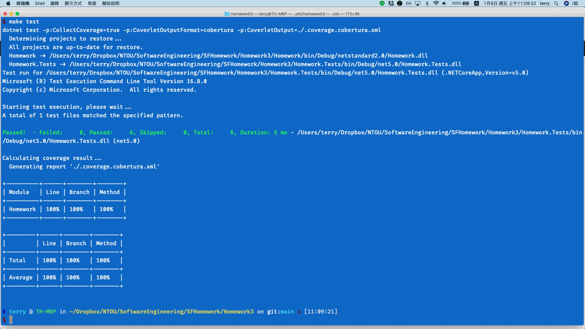

<!--<link href="https://fonts.googleapis.com/css2?family=Source+Code+Pro&display=swap" rel="stylesheet">-->
<link href="https://fonts.googleapis.com/css2?family=Fira+Code&display=swap" rel="stylesheet">
<link href="../static/main.css" rel="stylesheet" />

## Homework3 Stress Test Coverage (第二組)

### 組員

* 游X翰 4094W007
* 張X文 4094W010
* 李X成 4094W011
* 何X禹 4094W012
* 黃X賢 4094W008


程式邏輯
```{.cs .numberLines}
/// 找到，返回查找的學生學號
/// 沒找到，返回空字串
public class StudentFind
{
    private static int _maxNameLength = 32;
    private static int _maxSutdentsLength = 500;

    public string Find(string name, List<Student> students)
    {
        // check specification
        if (name.Length > _maxNameLength)
        {
            throw new System.ArgumentException($"The length of name not greater than {_maxNameLength}");
        }

        if (students.Count > _maxSutdentsLength)
        {
            throw new System.ArgumentException($"The length of students not greater than {_maxSutdentsLength}");
        }

        foreach (var item in students)
        {
            if (item.Name == name)
            {
                return item.Id;
            }
        }
        return "";
    }
}
```

## 制定程式規格

* 最大傳入的型別 string name 長度為 32 的字元長

* 最大尋找的學生陣列 List 大小長度不超過 500 

<p class="pagebreak" />

## Stress Test


### test case 1

students = { 
    new Student("4094W007", "Nick"), 
    new Student("4094W010", "Aven"), 
    new Student("4094W011", "Totti"),
};

1. input values: "" // 空字串
2. expected result: ""
3. test program's result: ""

### test case2 

1. input values: "JohnJohnJohnJohnJohnJohnJohnJohnJohnJohn" // 字串長度 40 超過程式規格
2. expected result: Exception System.ArgumentException
3. test program's result: Exception System.ArgumentException

### test case 3 

students = { 
    // 空陣列測試
};

1. input values: "Hello 0002" , <List>Student 0 個
2. expected result: ""
3. test program's result: ""

### test case 4 

students = { 
    new Student("ST0001", "Hello 0001"), 
    new Student("ST0002", "Hello 0002"), 
    new Student("ST0003", "Hello 0003"),
    ....
    // 超過程式規格 500 個學生
};

1. input values: "Hello 0002" , <List>Student 600 個
2. expected result: Exception System.ArgumentException
3. test program's result: Exception System.ArgumentException

## Test Result

{width=100%}
