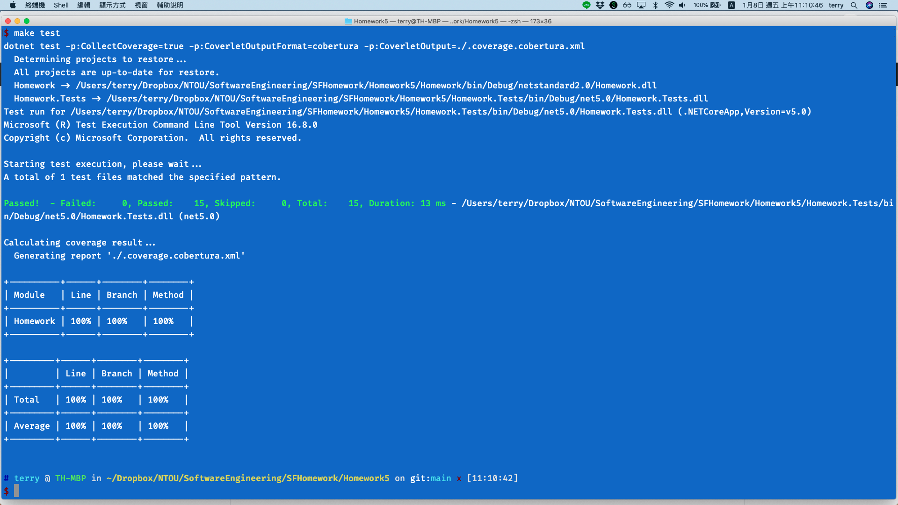

<link href="https://fonts.googleapis.com/css2?family=Fira+Code&display=swap" rel="stylesheet">
<link href="../static/main.css" rel="stylesheet" />

## Homework5 Input Domain Characterization (第二組)

### 組員

* 游X翰 4094W007
* 張X文 4094W010
* 李X成 4094W011
* 何X禹 4094W012
* 黃X賢 4094W008

程式邏輯
```{.cs .numberLines}
public string IsGoodStudent(string name, List<Student> students)
{
    foreach (var item in students)
    {
        if (item.Name == name && (
            (item.Bmi >= 18.5f && item.Bmi < 24.0f) || 
            item.Score >= 80.0f))
        {
            return "YES";
        } else if (item.Name == name) 
        {
            return "NO";
        }
    }
    // no found
    return "";
}
```

## Input Domain Characterization

```{.cs}
/// students
_students = new List<Student>
    {
        // name, score, bmi
        new Student("Nick", 95.0f, 22.0f),
        new Student("Jack", 79.0f, 23.0f),
        new Student("Clark", 79.0f, 17.0f),
        new Student("Peter", 82.0f, 17.0f),
        new Student("John", 80.0f, 26.0f),
        new Student("Mary", 77.0f, 25.0f),
    };


if (item.Name == name && ((item.Bmi >= 18.5f && item.Bmi < 24.0f) || item.Score >= 80.0f))
```
<p class="pagebreak" />

## Categorization Coverage

* Name => 
    1. Name == name
    2. Name != name

* Bmi => 
    1. Bmi < 18.5
    2. 18.5 <= Bmi < 24
    3. Bmi > 24 

* Score => 
    1. Score < 80
    2. Score >= 80

### test case 1 

Name: 1, Bmi: 1, Score: 1 

1. input values: "Clark"
2. expected result: "NO"
3. test program's result: "NO"

### test case 2 

Name: 2, Bmi: 2, Score: 2

1. input values: "Eric"
2. expected result: ""
3. test program's result: ""

### test case 3 

Name: 1, Bmi: 3, Score: 1 

1. input values: "Mary"
2. expected result: "NO"
3. test program's result: "NO"

## Combinatorial Coverage

### test case 1 

Name: 1, Bmi: 1, Score: 1 

1. input values: "Clark"
2. expected result: "NO"
3. test program's result: "NO"

### test case 2 

Name: 1, Bmi: 1, Score: 2 

1. input values: "Peter"
2. expected result: "YES"
3. test program's result: "YES"

<p class="pagebreak" />

::::columns
:::column
### test case 3 

Name: 1, Bmi: 2, Score: 1 

1. input values: "Jack"
2. expected result: "YES"
3. test program's result: "YES"

### test case 4 

Name: 1, Bmi: 2, Score: 2 

1. input values: "Nick"
2. expected result: "YES"
3. test program's result: "YES"

### test case 5 

Name: 1, Bmi: 3, Score: 1 

1. input values: "Mary"
2. expected result: "NO"
3. test program's result: "NO"

### test case 6 

Name: 1, Bmi: 3, Score: 2 

1. input values: "John"
2. expected result: "YES"
3. test program's result: "YES"

### test case 7 

Name: 2, Bmi: 1, Score: 1 

1. input values: "Eric"
2. expected result: ""
3. test program's result: ""

:::
:::column

### test case 8 

Name: 2, Bmi: 1, Score: 2 

1. input values: "Mike"
2. expected result: ""
3. test program's result: ""

### test case 9 

Name: 2, Bmi: 2, Score: 1 

1. input values: "Ted"
2. expected result: ""
3. test program's result: ""

### test case 10 

Name: 2, Bmi: 2, Score: 2 

1. input values: "William"
2. expected result: ""
3. test program's result: ""

### test case 11 

Name: 2, Bmi: 3, Score: 1 

1. input values: "Tom"
2. expected result: ""
3. test program's result: ""


### test case 12 

Name: 2, Bmi: 3, Score: 2 

1. input values: "Evon"
2. expected result: ""
3. test program's result: ""

:::
::::

## Test Result

{width=100%}
