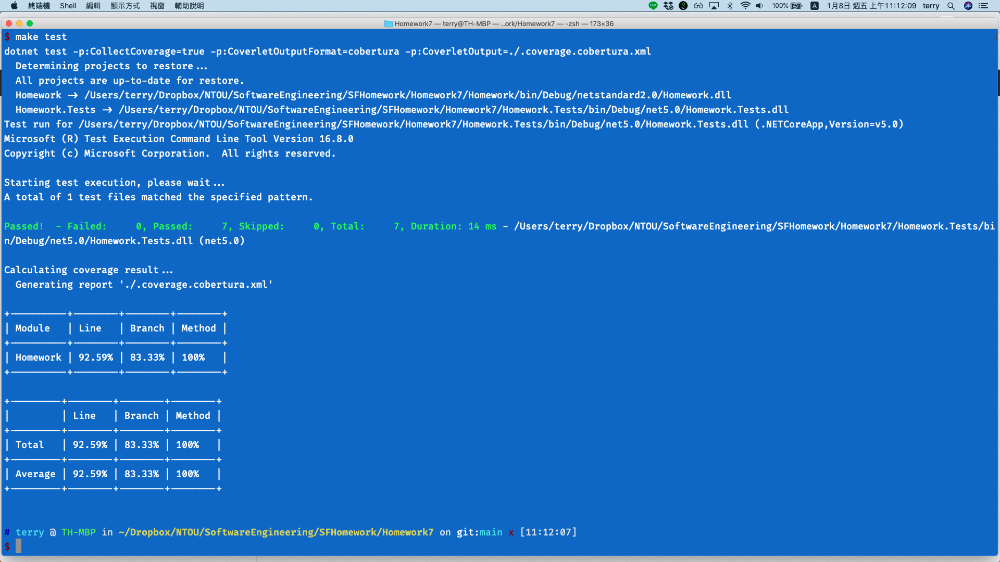

<link href="https://fonts.googleapis.com/css2?family=Fira+Code&display=swap" rel="stylesheet">
<link href="../static/main.css" rel="stylesheet" />

## Homework7 Equivalence Partition (第二組)

程式邏輯
```{.cs .numberLines}
public class StudentName
{
    private static string letter = @"^[a-z]{1}";
    private static string letterAndNumber = @"^[a-zA-Z0-9]+$";
    private static int _maxNameLength = 12;
    private static int _minNameLength = 3;

    public bool SetName(string id, string name, List<Student> students)
    {
        foreach (var item in students)
        {
            if (item.Id == id)
            {
                if (! Regex.IsMatch(name, letter))
                {
                    throw new System.FormatException($"The name should begin with lower case letter");
                }

                if (! Regex.IsMatch(name, letterAndNumber))
                {
                    throw new System.FormatException($"The name should only contain letter and number");
                }

                if (name.Length > _maxNameLength || name.Length < _minNameLength)
                {
                    throw new System.FormatException($"The length of name not greater than {_maxNameLength} and greater than {_minNameLength}");
                }

                
                item.Name = name;
                return true;
            }
        }
        return false;
    }
}
```

## 測試資料

```{.cs}
/// students
_students = new List<Student>
    {
        new Student("4094W020"),
        new Student("4094W021"),
    };
```

<p class="pagebreak" />

##  Equivalence partition 

程式功能 SetName (設定帳號名稱) specification

* 開頭第一個字必須是 a-z 的字母 
* 名字只能包含 a-z, A-Z 的字母，或阿拉伯數字0-9
* 名字長度不能小於 3 個字，不能超過 12 的字


### Test Input

* ericLin168 (1, 3, 5)
* Eric (2)
* eric$ (4)
* an (6)
* imNumber1SuperHero (7)


Specification condition Valid equivalence class   Invalid equivalence class
----------------------------- ------------------- -------------------------
 start chart                    start a-z (1)     start other (2)
 chart                          a-zA-Z0-9 (3)     others (4)
 length                         3-12 charts (5)    < 3 charts, > 12 charts (6,7)


### test case 1

valid start a-z

1. input values: "ericLin168"
2. expected result: true
3. test program's result: true

### test case 2

invalid start a-z 

1. input values: "Eric"
2. expected result: Exception System.FormatException 
3. test program's result: Exception System.FormatException

### test case 3

valid a-zA-Z0-9

1. input values: "ericLin168"
2. expected result: true
3. test program's result: true

### test case 4

invalid a-zA-Z0-9

1. input values: "eric$"
2. expected result: Exception System.FormatException
3. test program's result: Exception System.FormatException 

<p class="pagebreak" />

### test case 5 

valid 3-12 charts

1. input values: "ericLin168"
2. expected result: true
3. test program's result: true

### test case 6 

invalid &lt; 3 charts

1. input values: "an"
2. expected result: Exception System.FormatException 
3. test program's result: Exception System.FormatException 

### test case 7 

invalid &gt;  12 charts

1. input values: "imNumber1SuperHero"
2. expected result: Exception System.FormatException 
3. test program's result: Exception System.FormatException 

## Test Result

{width=100%}
