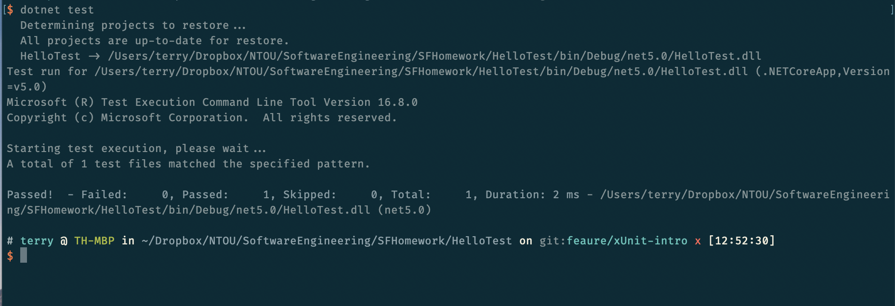

# xUnit (Team 2)

* 游X翰 4094W007
* 張X文 4094W010
* 李X成 4094W011
* 何X禹 4094W012
* 黃X賢 4094W008

---

# xUnit

* free, open source (Apache License, Version 2.0)
* Community-focused unit testing tool for the .NET Framework
* Written by the original inventor of NUnit v2
* Unit testing C#, F#, VB.NET and other .NET languages
* Cross platform support.

 https://xunit.net/docs/comparisons

---

# .NET SDK

* .NET is a free, cross-platform, open-source (MIT License)
* developer platform for building many different types of applications.
* .NET Core CLI. 
* .NET Core libraries and runtime.
* dotnet driver 

---

# Setting up Unit Testing

```{.sh}
dotnet new xunit -o Homework.Tests

```

* xUnit instantiates one instance of the class per test.
* can use the constructor to set up tests, TearDown via implements IDisposable
* use via command line or IDE

---


# Hello test
```{.csharp}

public class UnitTest1
{
   [Fact]
   public void Test1()
   {
      
   }
}
```
---

# Run test
```{.sh}
dotnet test
```



---


# Assertions

```{.csharp}
// Any values
int value = 0;
Assert.Equal(42, value);
Assert.NotEqual(42, value);

// Boolean
bool b = true;
Assert.True(b, "b should be true");
Assert.False(b, "b should be false");

// Contains/DoesNotContain
var names = new List<string> { "Picard", "Kirk" };
Assert.Contains("text", "This is a text.");
Assert.Contains(names, n => n == "Kirk");
Assert.DoesNotContain("sdf", "This is a text.");
```

---

# Assertions

```{.csharp
Assert.StartsWith("This is a text.", "This");
Assert.EndsWith("This is a text.", "text.");

var regEx = @"\A[A-Z0-9+_.-]+@[A-Z0-9.-]+\Z";

Assert.DoesNotMatch(regEx, "this is a text");
Assert.Matches(regEx, "this is a text");

Assert.Empty(new List<int> { });
Assert.NotEmpty(new List<int> { 1 });


Assert.InRange(3, 1, 6);
Assert.NotInRange(3, 1, 2);

var listWithSingle = new List<int> { 1 };
Assert.Single(listWithSingle);
```

---

# Type Based Assertions

```{.csharp}
Assert.IsType<string>("passes");

Assert.IsNotType<string>(1);
Assert.IsNotType<string>("fails");

Assert.IsAssignableFrom<IEnumerable<int>>(new List<int>());
Assert.IsAssignableFrom<IDictionary<int, string>>(new List<int>());

Assert.Null(null);
Assert.NotNull(new List<int>());

```

---

# input and expect reault

```
[Theory, InlineData("Totti", "4094W011")]
public void TestCase1(string name, string expectValue)
{
    var result = _studentFind.Find(name, _students);
    Assert.Equal(result, expectValue);
}
```


---

# Tests in parallel

```{.csharp}
// Test1 and Test2 runs sequentially => Runs in 10s
// Test3 and Test4 runs sequentially => Runs in 10s
// (Test1, Test2) runs in parallel with (Test3, Test4) => Runs in 10s
public class UnitTest1
{
    [Fact]
    public async Task Test1() => await Task.Delay(5000);

    [Fact]
    public async Task Test2() => await Task.Delay(5000);
}

public class UnitTest2
{
    [Fact]
    public void Test3() => Thread.Sleep(5000);

    [Fact]
    public void Test4() => Thread.Sleep(5000);
}

```

---


# Select to test

```{.csharp}
dotnet test --filter Area=1

```

```{.csharp}
[Trait("Area", "1")]
public class UnitTest1
{
    [Fact]
    public void Test1()
    {
        Console.WriteLine("TEST1");
    }

}

[Trait("Area", "2")]
public class UnitTest2
{
    [Fact]
    public void Test1()
    {
        Console.WriteLine("TEST2");
    }
}
```

---

# More && Live DEMO

* https://docs.microsoft.com/en-us/dotnet/core/testing/
* https://xunit.net/
